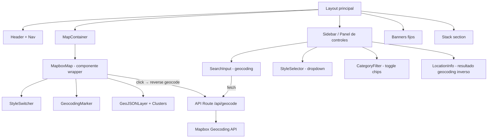

# Arquitectura — Mapbox GL JS · Con Criterio Tools

## Stack elegido

**Next.js 16 (App Router) + Tailwind CSS + shadcn/ui + mapbox-gl**

Justificación:

- **Next.js en lugar de Astro:** La demo necesita API routes para el proxy de geocoding (proteger el token de Mapbox). Mapbox GL JS requiere acceso al DOM y estado reactivo complejo (cambio de estilos, gestión de marcadores, toggle de capas). Next.js 16 con App Router y Turbopack ofrece SSR, API routes integradas y dev server rápido — más eficiente que Astro + islands para este caso.
- **Tailwind CSS:** Estilo por utilidades, consistente con el design system de Con Criterio.
- **shadcn/ui:** Componentes accesibles y estilizables (Select para estilos, Input para búsqueda, Card para info panels, Button para acciones). Evita escribir componentes de UI desde cero.
- **mapbox-gl (SDK oficial v3):** Instalación directa vía npm. Renderiza mapas vectoriales con WebGL. Incluye controles nativos de navegación, marcadores y popups.
- **TypeScript:** Tipado estricto. El SDK de Mapbox incluye tipos oficiales.

## Diagrama de componentes



## Estructura de carpetas

```
mapbox-concriterio-tools/
├── app/
│   ├── layout.tsx              # Layout global, fuentes, metadata
│   ├── page.tsx                # Página principal de la demo
│   └── api/
│       └── geocode/
│           └── route.ts        # Proxy de geocoding (forward + reverse)
├── components/
│   ├── map/
│   │   ├── MapboxMap.tsx       # Wrapper del mapa con ref
│   │   ├── StyleSwitcher.tsx   # Control de cambio de estilo
│   │   ├── GeoJSONLayer.tsx    # Capa de datos con clusters
│   │   └── MapMarker.tsx       # Marcador personalizado
│   ├── controls/
│   │   ├── SearchInput.tsx     # Input de búsqueda con geocoding
│   │   ├── CategoryFilter.tsx  # Filtros de categoría para GeoJSON
│   │   └── LocationInfo.tsx    # Panel de info de ubicación
│   ├── layout/
│   │   ├── Header.tsx
│   │   ├── Banners.tsx         # Los 3 banners fijos
│   │   └── StackSection.tsx    # Sección de tecnologías
│   └── ui/                     # Componentes shadcn/ui
├── lib/
│   ├── mapbox.ts               # Config y helpers de Mapbox
│   ├── geojson-data.ts         # Datos de ejemplo (POIs Barcelona)
│   └── constants.ts            # Estilos, coordenadas por defecto
├── public/
│   └── marker.svg              # Icono custom para marcadores
├── docs/
├── .env.example
├── CLAUDE.md
└── README.md
```

## Integraciones externas

| Servicio | Uso | Endpoint |
|----------|-----|----------|
| Mapbox GL JS | Renderizado de mapas | CDN/npm (`mapbox-gl`) |
| Mapbox Geocoding API | Forward + reverse geocoding | `https://api.mapbox.com/geocoding/v5/mapbox.places/` |
| Mapbox Styles | Estilos predefinidos | `mapbox://styles/mapbox/{style-id}` |

## Estrategia de protección de API keys

El `MAPBOX_ACCESS_TOKEN` se usa en dos contextos:

1. **Renderizado del mapa (cliente):** Mapbox GL JS requiere el token en el cliente para cargar tiles. Esto es inevitable y es el uso previsto por Mapbox. Se pasa como prop al componente del mapa usando `NEXT_PUBLIC_MAPBOX_TOKEN` — este es un token público con scopes limitados (solo lectura de estilos y tiles). Mapbox está diseñado para este modelo: el token público se restringe por dominio en el dashboard de Mapbox (URL restrictions).

2. **Geocoding API (servidor):** Las llamadas de geocoding pasan por `/api/geocode` en el servidor de Next.js. El token nunca se expone en las llamadas de geocoding del cliente. La API route recibe la query del cliente, hace la llamada a Mapbox y devuelve solo los resultados.

**Configuración de seguridad en Mapbox Dashboard:**
- Crear un token con URL restrictions: `mapbox.concriterio.tools` y `localhost:3000`
- Scopes mínimos: `styles:read`, `fonts:read`, `datasets:read`

## Configuración de Vercel

- **Framework:** Next.js (detección automática)
- **Build command:** `next build`
- **Output directory:** `.next`
- **Variables de entorno:**
  - `MAPBOX_ACCESS_TOKEN` → token de servidor (para API routes)
  - `NEXT_PUBLIC_MAPBOX_TOKEN` → token público restringido por dominio (para el cliente)
- **Dominio:** `mapbox.concriterio.tools` (wildcard ya configurado)
